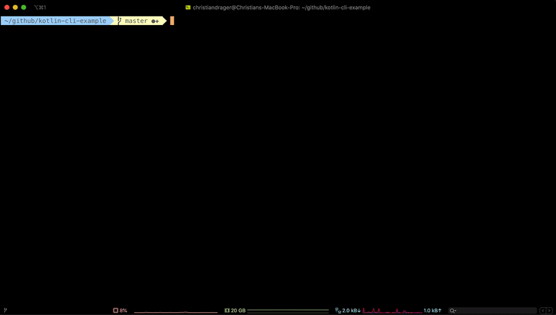
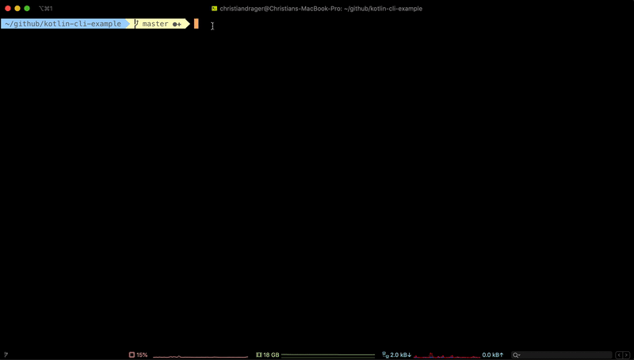

# kotlin-cli-example

This example project demonstrates how to build a CLI (command line interface) application with Kotlin

### Artifacts
The gradle build will produce a fatjar (jar that includes all its dependencies) and a native-image.

#### Jar

To **build the fat-jar** run:

    ./gradlew build

Afterwards the fat-jar can be found und `build/libs`-folder. 

To **execute the fat-jar** run:

    java -jar koltin-cli-example-all.jar

#### Native Binary

##### Prerequisites
* GraalVM installed
    * e.g. via [sdk-man](https://sdkman.io/install): `sdk use java 19.2.1-grl`
* native-image installed
    * simply run `gu install native-image`

To **build the native binary** run:

    ./gradlew nativeImage

The native-image (binary) can be found und `build/native-image`-folder.
To execute the native binary

    ./mycli
    
----

## Implemented Examples
There are a few use-cases implemented to show-case different behaviours a CLI can fulfill.

### Interactive Example
A little example of a CLI that will prompt fields to input data.
For source-code see [SayHello.kt](src/main/kotlin/commands/SayHello.kt)

To use the fatjar run:

    java -jar kotlin-cli-example-all.jar say-hello
    
To use the native binary run:

    ./mycli say-hello
    

----

### Grab data from WWW
A little Example that demonstrates how to make a http request and print received data to console.
For source-code see [LinkCrawler.kt](src/main/kotlin/commands/LinkCrawler.kt)

To use the fatjar run:

    java -jar kotlin-cli-example-all.jar link-crawler https://kotlinlang.org/docs/reference/
    
To use the native binary run:

    ./mycli link-crawler https://kotlinlang.org/docs/reference/
    

